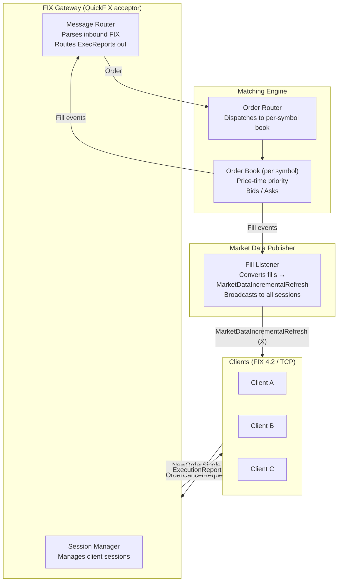

# Fix Exchange — Initial Architecture

## Overview

A simple equity exchange in C++ using the FIX protocol. Clients connect via FIX sessions to submit orders and receive execution reports and market data updates.

---

## Components



---

## FIX Message Types (Initial Set)

| Direction         | Message                          | Tag  | Purpose                        |
|-------------------|----------------------------------|------|--------------------------------|
| Client → Exchange | NewOrderSingle                   | D    | Submit a limit or market order |
| Client → Exchange | OrderCancelRequest               | F    | Cancel a resting order         |
| Exchange → Client | ExecutionReport                  | 8    | Ack, fill, or cancel confirm   |
| Exchange → Client | MarketDataIncrementalRefresh     | X    | Broadcast last trade           |

FIX version: **4.2**

---

## Matching Engine

### Order Book (per symbol)

```
Bids: std::map<double, std::queue<Order>, std::greater<>>   // highest price first
Asks: std::map<double, std::queue<Order>>                   // lowest price first
```

### Matching Logic

```
on NewOrder(order):
    if order is Limit:
        try_match(order)
        if order has remaining qty:
            add to resting side of book
    emit ExecutionReport (New or Filled)

try_match(aggressor):
    while aggressor has qty AND opposite side is non-empty:
        best = top of opposite side
        if aggressor.price crosses best.price (or market order):
            fill_qty = min(aggressor.qty, best.qty)
            emit Fill for both parties
            dequeue best if fully filled
        else:
            break
```

### Order struct (initial)

```cpp
struct Order {
    std::string order_id;
    std::string client_id;   // FIX SenderCompID
    std::string symbol;
    char side;               // '1' buy, '2' sell
    char type;               // '1' market, '2' limit
    double price;
    int qty;
    int leaves_qty;
};
```

---

## Directory Structure

```
fix-exchange/
├── CMakeLists.txt
├── config/
│   └── exchange.cfg          # QuickFIX acceptor config
├── src/
│   ├── main.cpp              # Entry point, wires components
│   ├── gateway/
│   │   ├── FixGateway.h/.cpp # QuickFIX Application impl
│   │   └── MessageFactory.h  # Builds outbound FIX messages
│   ├── engine/
│   │   ├── Order.h           # Order struct + enums
│   │   ├── OrderBook.h/.cpp  # Per-symbol book + matching
│   │   └── MatchingEngine.h/.cpp  # Routes orders to books
│   └── market_data/
│       └── MarketDataPublisher.h/.cpp  # Broadcasts fills
└── ARCHITECTURE.md
```

---

## Dependencies

| Library     | Purpose                          | Source                         |
|-------------|----------------------------------|--------------------------------|
| QuickFIX    | FIX engine (sessions, parsing)   | http://www.quickfixengine.org  |
| CMake 3.20+ | Build system                     |                                |

---

## Key Design Decisions (initial)

- **Single-threaded matching engine** — no locking complexity; the gateway posts work onto a queue consumed by one engine thread.
- **In-memory only** — no persistence, order IDs reset on restart.
- **One order book per symbol** — `MatchingEngine` holds a `std::unordered_map<string, OrderBook>`.
- **Broadcast on fill** — every fill emits an `ExecutionReport` to both parties and a `MarketDataIncrementalRefresh` to all connected sessions.
- **Limit and market orders only** — no stop orders, IOC, FOK, etc. in v1.

---

## What's Out of Scope (v1)

- Persistent order log / recovery
- Risk checks / pre-trade limits
- Multiple instruments / symbol directory
- Order book snapshot (MarketDataSnapshotFullRefresh)
- TLS / authentication
- Admin / drop-copy sessions
