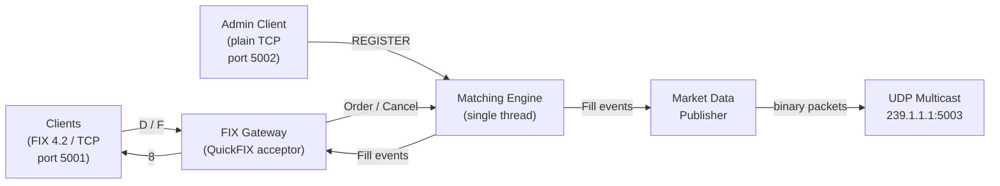
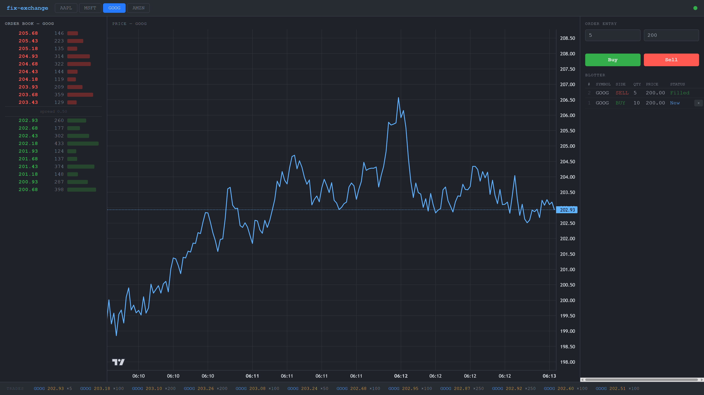

# FIX Exchange

A single-process equity exchange written in C++, running on AWS c6i.metal bare-metal (128-core Intel Ice Lake). Clients connect over TCP using the FIX 4.2 protocol to submit orders and receive execution reports. Market data is broadcast over UDP multicast as binary packets. A price-time priority matching engine runs on a dedicated thread. Resting orders, fills, cancels, and runtime symbol registrations are persisted to SQLite so the book survives restarts and crashes. Pre-trade risk controls are enforced before orders reach the matching engine.

## Performance

See [docs/BENCHMARKS.md](docs/BENCHMARKS.md) for methodology and scenario descriptions. See [docs/PERFORMANCE.md](docs/PERFORMANCE.md) for a history of performance improvements.

Benchmarks run automatically on AWS c6i.metal bare-metal after each release. Numbers reflect real hardware performance.

RTT latency distribution across all scenarios (latest release):


Solid lines are client-perceived RTT; dashed lines are internal exchange processing time (excludes TCP and client overhead). Results are recorded on each tagged release and committed to the repo.

<table><tr>
<td></td>
<td></td>
</tr></table>

To run the benchmark and record results for the current tagged version:

```bash
. .venv/bin/activate
pip install rich matplotlib numpy   # first time only
python3 bench/bench.py --save       # records results to bench/results.db
python3 bench/plot_history.py       # regenerates trend charts from DB
```

## Dependencies

| Dependency     | Version | Install                            |
| -------------- | ------- | ---------------------------------- |
| g++ or clang++ | C++14+  | system                             |
| CMake          | 3.20+   | system                             |
| QuickFIX       | 1.14+   | `sudo apt install libquickfix-dev` |
| SQLite3        | 3.x     | `sudo apt install libsqlite3-dev`  |
| OpenSSL        | any     | usually pre-installed              |
| abseil-cpp     | 20240722.0 | fetched automatically by CMake  |

### One-time setup (Ubuntu)

```bash
sudo apt install libquickfix-dev libsqlite3-dev
```

## Architecture

See [docs/ARCHITECTURE.md](docs/ARCHITECTURE.md) for the full component diagram and design decisions.



## Build

```bash
cmake -B build -DCMAKE_BUILD_TYPE=Debug
cmake --build build -j$(nproc)
```

For a release build (targets c6i.metal / Ice Lake Xeon — run on the server, not locally):

```bash
cmake -B build -DCMAKE_BUILD_TYPE=Release
cmake --build build -j$(nproc)
```

The binary is placed at `build/fix-exchange`.

## Running

```bash
./build/fix-exchange config/exchange.cfg
```

The exchange starts a FIX acceptor on **port 5001** and an admin gateway on **port 5002**. Session logs go to `log/` and sequence number state to `store/`. Both directories are created automatically on first run. See [docs/MESSAGES.md](docs/MESSAGES.md) for the FIX message reference and UDP market data wire format.

Stop with `Ctrl+C` or `SIGTERM`.

To reset sequence numbers between runs, delete `store/`:

```bash
rm -rf store/
```

## Trading UI

A browser-based interface for placing orders and watching the live order book. See [docs/UI.md](docs/UI.md) for full details.



```bash
python3 -m venv .venv && . .venv/bin/activate
pip install -r requirements.txt
python3 ui/main.py        # → http://localhost:8080
```

Each server process claims one FIX session from the pool. Run two instances on different ports to get two independent clients that can trade against each other.

## Testing

The test suite manages the exchange process itself — no manual server start required:

```bash
python3 tests/run_all.py
```

The binary must be built first. Tests connect over raw TCP on port 5001 using hand-rolled FIX framing with no external Python libraries. UI server tests additionally start a uvicorn subprocess on port 18080 and use `websockets` to connect.

## Configuration

The config file is a QuickFIX acceptor config extended with `[EXCHANGE]` and `[RISK]` sections. See [docs/CONFIGURATION.md](docs/CONFIGURATION.md) for a full reference.

Key settings in `config/exchange.cfg`:

```ini
[DEFAULT]
BeginString=FIX.4.2
DataDictionary=spec/FIX42.xml
FileStorePath=store
FileLogPath=log
SocketAcceptPort=5001

[EXCHANGE]
Symbols=AAPL,MSFT,GOOG,AMZN
AdminPort=5002
MulticastGroup=239.1.1.1
MulticastPort=5003
SessionPool=8
DatabasePath=store/exchange.db
```
