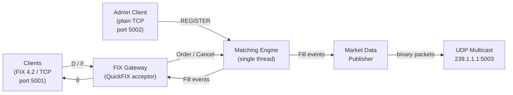

# fix-exchange

A single-process equity exchange written in C++. Clients connect over TCP using the FIX 4.2 protocol to submit orders and receive execution reports. Market data is broadcast over UDP multicast as binary packets. A price-time priority matching engine runs on a dedicated thread.

---

## Architecture

See [docs/ARCHITECTURE.md](docs/ARCHITECTURE.md) for the full component diagram and design decisions.



---

## Dependencies

| Dependency | Version | Install |
|------------|---------|---------|
| g++ or clang++ | C++14+ | system |
| CMake | 3.20+ | system |
| QuickFIX | 1.14+ | `sudo apt install libquickfix-dev` |
| OpenSSL | any | usually pre-installed |

### One-time setup (Ubuntu / WSL2)

```bash
sudo apt install libquickfix-dev
```

---

## Build

```bash
cmake -B build -DCMAKE_BUILD_TYPE=Debug
cmake --build build -j$(nproc)
```

For a release build:

```bash
cmake -B build -DCMAKE_BUILD_TYPE=Release
cmake --build build -j$(nproc)
```

The binary is placed at `build/fix-exchange`.

---

## Running

```bash
./build/fix-exchange config/exchange.cfg
```

The exchange starts a FIX acceptor on **port 5001** and an admin gateway on **port 5002**. Session logs go to `log/` and sequence number state to `store/`. Both directories are created automatically on first run. See [docs/MESSAGES.md](docs/MESSAGES.md) for the FIX message reference and UDP market data wire format.

Stop with `Ctrl+C` or `SIGTERM`.

To reset sequence numbers between runs, delete `store/`:

```bash
rm -rf store/
```

---

## Testing

The test suite manages the exchange process itself — no manual server start required:

```bash
python3 tests/test_exchange.py
```

The binary must be built first. Tests connect over raw TCP on port 5001 using hand-rolled FIX framing with no external Python libraries.

---

## Configuration

The config file is a QuickFIX acceptor config extended with an `[EXCHANGE]` section. See [docs/CONFIGURATION.md](docs/CONFIGURATION.md) for a full reference.

Key settings in `config/exchange.cfg`:

```ini
[DEFAULT]
BeginString=FIX.4.2
DataDictionary=spec/FIX42.xml
FileStorePath=store
FileLogPath=log

[SESSION]
SenderCompID=EXCHANGE
TargetCompID=CLIENT
SocketAcceptPort=5001

[EXCHANGE]
Symbols=AAPL,MSFT,GOOG,AMZN
AdminPort=5002
MulticastGroup=239.1.1.1
MulticastPort=5003
```

