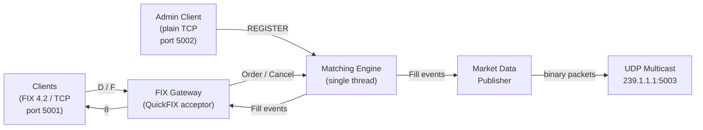

# fix-exchange

A single-process equity exchange written in C++. Clients connect over TCP using the FIX 4.2 protocol to submit orders and receive execution reports. Market data is broadcast over UDP multicast as binary packets. A price-time priority matching engine runs on a dedicated thread.

---

## Architecture

See [docs/ARCHITECTURE.md](docs/ARCHITECTURE.md) for the full component diagram and design decisions.



---

## Dependencies

| Dependency | Version | Install |
|------------|---------|---------|
| g++ or clang++ | C++14+ | system |
| CMake | 3.20+ | system |
| QuickFIX | 1.14+ | `sudo apt install libquickfix-dev` |
| OpenSSL | any | usually pre-installed |

### One-time setup (Ubuntu / WSL2)

```bash
sudo apt install libquickfix-dev
```

---

## Build

```bash
cmake -B build -DCMAKE_BUILD_TYPE=Debug
cmake --build build -j$(nproc)
```

For a release build:

```bash
cmake -B build -DCMAKE_BUILD_TYPE=Release
cmake --build build -j$(nproc)
```

The binary is placed at `build/fix-exchange`.

---

## Running

```bash
./build/fix-exchange config/exchange.cfg
```

The exchange starts a FIX acceptor on **port 5001** and an admin gateway on **port 5002**. Session logs go to `log/` and sequence number state to `store/`. Both directories are created automatically on first run.

Stop with `Ctrl+C` or `SIGTERM`.

To reset sequence numbers between runs, delete `store/`:

```bash
rm -rf store/
```

---

## Testing

The test suite manages the exchange process itself — no manual server start required:

```bash
python3 tests/test_exchange.py
```

The binary must be built first. Tests connect over raw TCP on port 5001 using hand-rolled FIX framing with no external Python libraries.

### What is tested

| Test | Description |
|------|-------------|
| Logon / Logout | Session establishment and clean teardown |
| NewOrderSingle → ExecReport(New) | Order acknowledgment |
| Order matching | Two crossing limit orders produce fill ExecReports |
| OrderCancelRequest | Resting order cancelled, ExecReport(Canceled) returned |
| Unknown symbol rejected | Orders for unregistered symbols get ExecReport(Rejected) |
| Admin REGISTER | New symbol registered at runtime via admin port, then accepted |
| IOC — no fill | IOC order with no liquidity is immediately cancelled |
| IOC — partial fill | IOC order fills available qty, remainder cancelled |
| FOK — insufficient qty | FOK order rejected outright if full qty unavailable |
| FOK — full fill | FOK order executes completely when full qty available |
| Order status on reconnect | ExecType=I reports replayed for client's open orders on reconnect |
| UDP market data — new order | NewOrder packet on UDP multicast when a limit order rests |
| UDP market data — cancel | Cancel packet on UDP multicast when a resting order is cancelled |
| UDP market data — fill | FillResting + Trade packets on UDP multicast when orders match |

---

## Configuration

The config file is a QuickFIX acceptor config extended with an `[EXCHANGE]` section. See [docs/CONFIGURATION.md](docs/CONFIGURATION.md) for a full reference.

Key settings in `config/exchange.cfg`:

```ini
[DEFAULT]
BeginString=FIX.4.2
DataDictionary=spec/FIX42.xml
FileStorePath=store
FileLogPath=log

[SESSION]
SenderCompID=EXCHANGE
TargetCompID=CLIENT
SocketAcceptPort=5001

[EXCHANGE]
Symbols=AAPL,MSFT,GOOG,AMZN
AdminPort=5002
MulticastGroup=239.1.1.1
MulticastPort=5003
```

---

## FIX Message Reference

| Direction | MsgType | Tag | Purpose |
|-----------|---------|-----|---------|
| Client → Exchange | NewOrderSingle | D | Submit a limit or market order |
| Client → Exchange | OrderCancelRequest | F | Cancel a resting order |
| Client → Exchange | OrderCancelReplaceRequest | G | Modify qty or price of a resting order |
| Exchange → Client | ExecutionReport | 8 | Ack, fill, cancel confirm, or order status |
| UDP multicast | — | — | Binary market data packets (see below) |

### UDP Market Data

Market data is published as 46-byte binary packets to a UDP multicast group (default `239.1.1.1:5003`). Any number of subscribers can receive the feed by joining the group — no FIX session or subscription message required.

| Field | Type | Size | Notes |
|-------|------|------|-------|
| `seq` | uint64 | 8 | Monotonically increasing; use to detect gaps |
| `event_type` | uint8 | 1 | See table below |
| `side` | uint8 | 1 | `'0'`=bid, `'1'`=ask, `'2'`=trade |
| `symbol` | char[8] | 8 | NUL-padded |
| `price` | double | 8 | IEEE 754 little-endian |
| `qty` | int32 | 4 | leaves_qty for book events; fill qty for Trade |
| `exchange_id` | char[16] | 16 | NUL-padded |

| `event_type` | Value | Meaning |
|---|---|---|
| `NewOrder` | 0 | Limit order rested on the book |
| `Cancel` | 1 | Resting order removed |
| `FillResting` | 2 | Resting side updated by a fill (qty = remaining; 0 = fully consumed) |
| `Trade` | 3 | Trade print (qty = filled quantity) |
| `ReplaceInPlace` | 4 | Qty-only reduction at same price |
| `ReplaceDelete` | 5 | First packet of a price-change replace — removes old price level |
| `ReplaceNew` | 6 | Second packet of a price-change replace — adds at new price level |

There is no recovery channel. Subscribers should use `seq` to detect gaps and handle them at the application level.

### ExecutionReport ExecTypes (tag 150)

| Value | Meaning |
|-------|---------|
| `0` | New — order accepted and resting |
| `1` | PartialFill — partial fill, order still resting |
| `2` | Fill — fully filled |
| `4` | Canceled — cancel confirmed |
| `8` | Rejected — order rejected (e.g. unknown symbol) |
| `I` | OrderStatus — open order replayed on reconnect |

---

## Project Layout

```
fix-exchange/
├── CMakeLists.txt
├── config/
│   └── exchange.cfg              QuickFIX + exchange config
├── spec/
│   └── FIX42.xml                 FIX 4.2 data dictionary
├── src/
│   ├── main.cpp                  Entry point — wires components
│   ├── admin/
│   │   └── AdminGateway.h/.cpp   Plain-TCP admin command interface
│   ├── gateway/
│   │   ├── FixGateway.h/.cpp     QuickFIX Application, message parsing
│   │   └── MessageFactory.h      Builds all outbound FIX messages
│   ├── engine/
│   │   ├── Order.h               Order, Fill, CancelRequest, BookSnapshot structs
│   │   ├── OrderBook.h/.cpp      Price-time priority book per symbol
│   │   └── MatchingEngine.h/.cpp Routes orders to books, engine thread
│   └── market_data/
│       ├── MarketDataEvent.h           Binary UDP packet struct + EventType enum
│       └── MarketDataPublisher.h/.cpp  Broadcasts fills via UDP multicast
└── tests/
    └── test_exchange.py          Integration test suite (pure Python 3)
```
