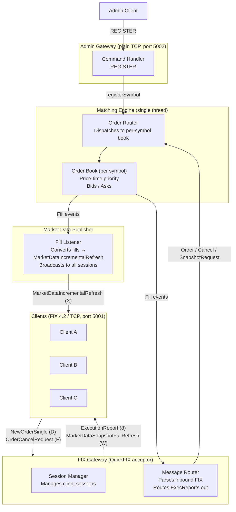

# Fix Exchange — Architecture

## Overview

A single-process equity exchange in C++ using the FIX 4.2 protocol. Three threads with a fixed topology; the matching engine is the only thread that touches order book state.

---

## Components



---

## Threading Model

Three threads, fixed topology:

- **QuickFIX thread** — runs the FIX acceptor, calls `FixGateway` callbacks (`onLogon`, `onMessage`, etc.)
- **Engine thread** — the only thread that reads or writes order book state; `MatchingEngine::run()` drains a `std::queue<WorkItem>` via `std::mutex + std::condition_variable`
- **Admin thread** — `AdminGateway` accepts plain-TCP connections and calls `MatchingEngine::registerSymbol()`

`FixGateway` submits work to the engine via `engine_.submit()` / `engine_.cancel()` / `engine_.requestSnapshot()`, all of which lock the work queue. Fill and cancel callbacks are invoked on the engine thread and must be thread-safe.

`MarketDataPublisher` holds its own mutex and broadcasts fills to all registered FIX sessions. It is called from the engine thread (fills) and the QuickFIX thread (session logon/logout).

---

## FIX Message Types

| Direction | Message | Tag | Purpose |
|-----------|---------|-----|---------|
| Client → Exchange | NewOrderSingle | D | Submit a limit or market order |
| Client → Exchange | OrderCancelRequest | F | Cancel a resting order |
| Exchange → Client | ExecutionReport | 8 | Ack, fill, cancel confirm, order status replay |
| Exchange → Client | MarketDataSnapshotFullRefresh | W | Full book depth delivered on logon |
| Exchange → Client | MarketDataIncrementalRefresh | X | Last trade broadcast to all sessions |

FIX version: **4.2**

---

## Matching Engine

### Order Book (per symbol)

```
Bids: std::map<double, std::deque<Order>, std::greater<>>   // highest price first
Asks: std::map<double, std::deque<Order>>                   // lowest price first
```

### Matching Logic

```
on NewOrder(order):
    if FOK: check available_to_fill; cancel immediately if insufficient
    try_match(order)
    if IOC and leaves_qty > 0: cancel remainder
    if limit and GTC and leaves_qty > 0: rest in book
    emit ExecutionReport (New, PartialFill, Fill, or Canceled)

try_match(aggressor):
    while aggressor has qty AND opposite side is non-empty:
        best = top of opposite side
        if aggressor.price crosses best.price (or market order):
            fill_qty = min(aggressor.leaves_qty, best.leaves_qty)
            emit Fill for both parties
            dequeue best if fully filled
        else:
            break
```

### Order struct

```cpp
struct Order {
    std::string clord_id;      // FIX tag 11 — client-assigned reference
    std::string exchange_id;   // FIX tag 37 — exchange-assigned, e.g. "EXCH-1"
    std::string client_id;     // FIX SenderCompID
    std::string symbol;
    char side;                 // '1' buy, '2' sell
    char type;                 // '1' market, '2' limit
    double price;
    int qty;
    int leaves_qty;
    char tif;                  // '0'=GTC, '3'=IOC, '4'=FOK (FIX tag 59)
};
```

---

## Symbol Registry

Symbols are loaded at startup from the `[EXCHANGE]` section of the config file. `MatchingEngine` validates incoming orders against `valid_symbols_` (guarded by `symbols_mutex_`). Orders for unknown symbols are rejected with `ExecutionReport(Rejected)` in the gateway before they reach the engine. New symbols can be registered at runtime via the admin gateway (`REGISTER <symbol>`).

---

## Order ID Duality

Every order carries two IDs:

- `clord_id` — FIX tag 11, client-assigned, used for cancel references
- `exchange_id` — exchange-assigned (`EXCH-<seq>`), stable internal key

`FixGateway` maintains three maps under `orders_mutex_`: `order_sessions_` (exchange_id → SessionID), `active_orders_` (exchange_id → Order), and `clord_to_exchange_` (clord_id → exchange_id).

---

## Logon Sequence

On client logon, `FixGateway::onLogon` does three things in order:

1. Registers the session with `MarketDataPublisher` (for future fill broadcasts)
2. Sends `ExecutionReport(ExecType=I)` for every open order belonging to this client's `SenderCompID` — allows reconnecting clients to recover their resting order state
3. Enqueues a snapshot request on the engine work queue — the engine processes it on its thread, reads all books, and sends a `MarketDataSnapshotFullRefresh (35=W)` per non-empty symbol back to the client

---

## Key Design Decisions

- **Single-threaded matching engine** — no locking complexity on the hot path; the gateway posts work onto a queue consumed by one engine thread.
- **In-memory only** — no persistence; order IDs reset on restart.
- **One order book per symbol** — `MatchingEngine` holds a `std::unordered_map<string, OrderBook>`.
- **Broadcast on fill** — every fill emits `ExecutionReport` to both parties and `MarketDataIncrementalRefresh` to all connected sessions.
- **Snapshot via work queue** — book snapshot requests are routed through the engine work queue so they execute on the engine thread, avoiding any data race with order processing.

---

## What's Out of Scope

- Persistent order log / crash recovery
- Risk checks / pre-trade limits
- TLS / authentication
- Stop orders
- Drop-copy sessions
