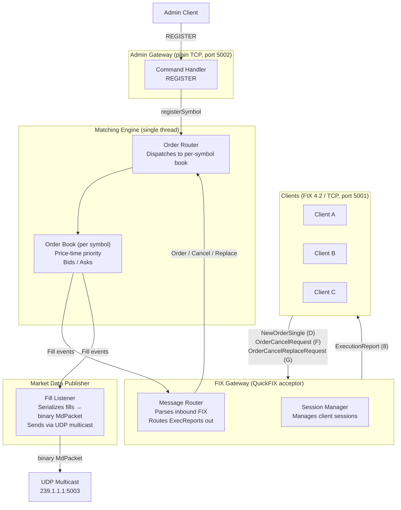

# Fix Exchange — Architecture

## Overview

A single-process equity exchange in C++ using the FIX 4.2 protocol. Four threads with a fixed topology; the matching engine is the only thread that touches order book state. Market data is broadcast via UDP multicast as binary packets rather than over FIX sessions. Order state is persisted to SQLite so the book survives restarts.

## Components



## Threading Model

Four threads, fixed topology:

- **QuickFIX thread** — runs the FIX acceptor, calls `FixGateway` callbacks (`onLogon`, `onMessage`, etc.)
- **Engine thread** — the only thread that reads or writes order book state; `MatchingEngine::run()` drains a `RingBuffer<WorkItem, 4096>` (SPSC lock-free ring buffer); idles on `idle_cv_` when the queue is empty
- **Admin thread** — `AdminGateway` accepts plain-TCP connections and calls `MatchingEngine::registerSymbol()`
- **Persistence thread** — `PersistenceLayer::run()` drains a `std::queue<PersistenceEvent>` every 5 ms and flushes each batch to SQLite in a single transaction

`FixGateway` submits work to the engine via `engine_.submit()` / `engine_.cancel()` / `engine_.replace()`, all of which push onto the lock-free work queue. Fill and cancel callbacks are invoked on the engine thread and must be thread-safe.

`MarketDataPublisher` holds a single UDP multicast socket and an atomic sequence counter. It is called exclusively from the engine thread (fill/cancel/replace/rested callbacks), so no mutex is needed.

The engine thread (via gateway callbacks) enqueues `PersistenceEvent` structs onto the persistence queue without blocking. The persistence thread wakes up, batches all pending events, and writes them in one `BEGIN … COMMIT`. This keeps disk I/O off the matching hot path at the cost of a small dual-write window: if the process crashes between an exec report being sent and the flush completing, the DB will not reflect that event and the order will re-appear as resting on recovery.

## FIX Message Types

| Direction         | Message                   | Tag | Purpose                                        |
| ----------------- | ------------------------- | --- | ---------------------------------------------- |
| Client → Exchange | NewOrderSingle            | D   | Submit a limit or market order                 |
| Client → Exchange | OrderCancelRequest        | F   | Cancel a resting order                         |
| Client → Exchange | OrderCancelReplaceRequest | G   | Modify qty or price of a resting order         |
| Exchange → Client | ExecutionReport           | 8   | Ack, fill, cancel confirm, order status replay |
| UDP multicast     | —                         | —   | Binary `MdPacket` (46 bytes) per book event    |

FIX version: **4.2**

### Market Data Wire Format (`MdPacket`)

Defined in `src/market_data/MarketDataEvent.h`. Packed struct, little-endian:

| Field         | Type     | Meaning                                                                                                     |
| ------------- | -------- | ----------------------------------------------------------------------------------------------------------- |
| `seq`         | uint64   | Monotonically increasing; gap detection                                                                     |
| `event_type`  | uint8    | `NewOrder`=0, `Cancel`=1, `FillResting`=2, `Trade`=3, `ReplaceInPlace`=4, `ReplaceDelete`=5, `ReplaceNew`=6 |
| `side`        | uint8    | `'0'`=bid, `'1'`=ask, `'2'`=trade                                                                           |
| `symbol`      | char[8]  | NUL-padded                                                                                                  |
| `price`       | double   | IEEE 754                                                                                                    |
| `qty`         | int32    | leaves_qty for book events; fill qty for `Trade`                                                            |
| `exchange_id` | char[16] | NUL-padded                                                                                                  |

## Matching Engine

### Order Book (per symbol)

```
Bids: std::map<double, std::list<Order>, std::greater<>>   // highest price first
Asks: std::map<double, std::list<Order>>                   // lowest price first
order_index_: std::unordered_map<std::string, std::list<Order>::iterator>  // O(1) cancel
```

### Matching Logic

```
on NewOrder(order):
    if FOK: check available_to_fill; cancel immediately if insufficient
    try_match(order)
    if IOC and leaves_qty > 0: cancel remainder
    if limit and GTC and leaves_qty > 0: rest in book
    emit ExecutionReport (New, PartialFill, Fill, or Canceled)

try_match(aggressor):
    while aggressor has qty AND opposite side is non-empty:
        best = top of opposite side
        if aggressor.price crosses best.price (or market order):
            fill_qty = min(aggressor.leaves_qty, best.leaves_qty)
            emit Fill for both parties
            dequeue best if fully filled
        else:
            break
```

### Order struct

```cpp
struct Order {
    std::string clord_id;      // FIX tag 11 — client-assigned reference
    std::string exchange_id;   // FIX tag 37 — exchange-assigned, e.g. "EXCH-1"
    std::string client_id;     // FIX SenderCompID
    std::string symbol;
    char side;                 // '1' buy, '2' sell
    char type;                 // '1' market, '2' limit
    double price;
    int qty;
    int leaves_qty;
    char tif;                  // '0'=GTC, '3'=IOC, '4'=FOK (FIX tag 59)
};
```

## Symbol Registry

Symbols are loaded at startup from the `[EXCHANGE]` section of the config file. `MatchingEngine` validates incoming orders against `valid_symbols_` (guarded by `symbols_mutex_`). Orders for unknown symbols are rejected with `ExecutionReport(Rejected)` in the gateway before they reach the engine. New symbols can be registered at runtime via the admin gateway (`REGISTER <symbol>`).

## Order ID Duality

Every order carries two IDs:

- `clord_id` — FIX tag 11, client-assigned, used for cancel references
- `exchange_id` — exchange-assigned (`EXCH-<seq>`), stable internal key

`FixGateway` maintains three maps under `orders_mutex_`: `order_sessions_` (exchange_id → SessionID), `active_orders_` (exchange_id → Order), and `clord_to_exchange_` (clord_id → exchange_id).

## Logon Sequence

On client logon, `FixGateway::onLogon` sends a sequence of `ExecutionReport` messages to the reconnecting client:

1. **ExecType=I** — one report per open/resting order belonging to this client's `SenderCompID`, so the client can rebuild its live order state.
2. **ExecType=2 (Fill)** — replayed from the persistence layer for each historical fill recorded under this `client_id`.
3. **ExecType=4 (Canceled)** — replayed for each historical cancel.

No market data snapshot is sent; clients receive the live UDP multicast feed going forward.

## Key Design Decisions

- **Single-threaded matching engine** — no locking complexity on the hot path; the gateway posts work onto a queue consumed by one engine thread.
- **Async persistence** — all SQLite writes happen on a dedicated thread. The engine never blocks on disk. Set `DatabasePath` in `[EXCHANGE]` to enable; omit for in-memory-only mode.
- **Crash recovery** — on startup, `resting_orders` is loaded into the engine before the FIX acceptor starts. Reconnecting clients receive `ExecType=I` status reports for their restored orders via `onLogon`.
- **One order book per symbol** — `MatchingEngine` holds a `std::unordered_map<string, OrderBook>`.
- **UDP multicast market data** — every book event emits a 46-byte binary `MdPacket` to a multicast group. Any number of subscribers receive the same feed with a single `sendto()`. No session management, no subscription protocol.
- **ExecutionReport to parties only** — fill `ExecutionReport` messages go to the maker and taker over their FIX sessions; book-level market data goes to the multicast group.
