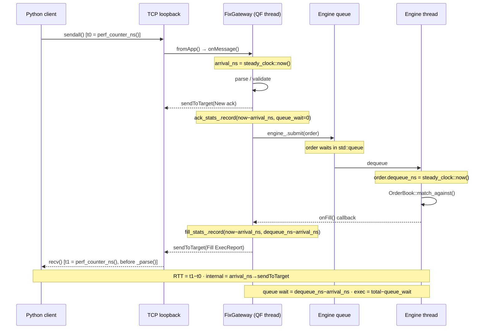

# Benchmarks

Two complementary latency measurements are taken on every benchmark run:

- **RTT** — client-perceived: from Python `sendall()` returning to `recv()` completing (before FIX parse). Includes TCP loopback and Python overhead.
- **Internal** — exchange-side: from `FixGateway::onMessage()` entry to `Session::sendToTarget()` for the response ExecReport. Pure exchange processing time.
- **Queue wait** — subset of internal: time the order spent in `std::queue<WorkItem>` waiting for the engine thread to dequeue it.



## Running

```bash
. .venv/bin/activate
pip install rich matplotlib   # first time only

python3 bench/bench.py [options]
```

| Flag | Default | Description |
|------|---------|-------------|
| `--count N` | 500 | iterations per scenario |
| `--scenario NAME` | all | `add`, `cancel`, `match`, `mixed`, or `all` |
| `--out DIR` | `bench/bench_results` | where to write PNG charts |
| `--no-spawn` | — | connect to an already-running exchange |
| `--host` / `--port` | 127.0.0.1 / 5001 | FIX acceptor address |
| `--admin-port` | 5002 | admin gateway port (for internal stats) |
| `--save` | — | persist raw samples to `bench/results.db` and regenerate trend charts |

Charts are saved to `bench/bench_results/`.

## Scenarios

### `add` — order add latency
Sends N `NewOrderSingle` (resting limit buys at non-crossing prices) and measures the RTT from send to `ExecReport(New)`. Internal track: `ack_total` (arrival → New-ack send). Isolates the FIX parse → validate → ack path; the order is still submitted to the engine but the ack goes back before matching.

### `cancel` — cancel latency
Places an order, then immediately cancels it. Measures RTT from `OrderCancelRequest` send to `ExecReport(Canceled)`. One order in flight at a time; the book is nearly empty.

### `match` — match latency
Alternates a resting sell with an aggressive buy that always crosses. Measures RTT from the aggressive-buy send to its `ExecReport(Fill)`. Internal track: `fill_total` (taker arrival → Fill-ExecReport send), split into queue-wait and execution time.

### `mixed` — cancel under load
Pre-loads N/2 resting orders to populate the book, then cancels all of them sequentially. Cancel latency here reflects the engine under a non-trivial book size.

## Metrics

| Metric | Description |
|--------|-------------|
| RTT p50/p95/p99 | client-perceived round-trip latency percentiles |
| internal p50/p99 | exchange processing time (arrival → ExecReport send) |
| queue wait p50 | time order spent waiting in engine queue |
| exec time | internal − queue wait = pure book-matching time |
| ops/sec | 1 / mean RTT latency, reported per scenario |

Internal stats are collected by the exchange process and queried via `STATS` on the admin port after each scenario. Raw nanosecond samples are returned and exact percentiles are computed by the benchmark script.

## Historical tracking (`--save`)

Pass `--save` to persist raw latency samples to `bench/results.db` and immediately regenerate the trend charts. Intended to be run on each tagged release:

```bash
git tag v1.11.0
python3 bench/bench.py --save
```

Re-running `--save` on the same version overwrites the previous results for that version. Raw samples are stored per order per scenario so any percentile can be recomputed later.

To regenerate trend charts from existing data without re-running the benchmark:

```bash
python3 bench/plot_history.py
```

This produces `bench/bench_results/trend_p50.png` and `bench/bench_results/trend_ops.png`.

## Results

Run `python3 bench/bench.py` to generate current numbers.

**Latency CDF** — cumulative distribution of client-perceived RTT for each scenario. A curve shifted left means lower latency; a steeper slope means tighter distribution. The p50/p95/p99 reference lines show how the tail behaves under WSL2 scheduling jitter.


**Throughput** — sequential ops/sec derived from mean RTT (1 / mean latency), one bar per scenario. This reflects single-client sequential throughput, not peak concurrent capacity.


**Internal vs RTT** — compares three p50 numbers side-by-side for each scenario: client-perceived RTT, internal exchange processing time (arrival → ExecReport send), and queue wait (time the request sat in the engine queue waiting to be dequeued). The gap between RTT and internal is TCP loopback + Python overhead. The gap between internal and queue wait is pure book-matching execution time.


| scenario | n   | rtt p50  | rtt p99  | internal p50 | queue wait p50 | ops/sec |
|----------|-----|----------|----------|--------------|----------------|---------|
| add      | 500 | 68.1 µs  | 316.6 µs | 31.0 µs      | 0.0 µs         | 12,331  |
| cancel   | 500 | 82.9 µs  | 368.1 µs | 48.6 µs      | 13.4 µs        | 10,925  |
| match    | 500 | 135.2 µs | 274.1 µs | 102.6 µs     | 42.6 µs        | 7,081   |
| mixed    | 500 | 72.6 µs  | 120.0 µs | 43.2 µs      | 13.1 µs        | 13,602  |

*Release build, loopback TCP, WSL2. Add queue wait is 0 µs because the New ack is sent on the QuickFIX thread before the order reaches the engine queue. Cancel/mixed queue wait (~13 µs) reflects condition-variable wake-up; match is higher (~43 µs) because the engine is fully idle between iterations.*

## Historical trends

Run `python3 bench/bench.py --save` on a tagged commit to record results in `bench/results.db` and regenerate these charts. Re-running on the same tag overwrites that version's data. The DB is committed to the repo so history accumulates across releases.

**p50 Latency by Version** — RTT (solid) and internal processing time (dashed) per scenario per release. A downward trend means the exchange got faster; diverging RTT and internal lines indicate growing TCP/Python overhead relative to engine time.


**Throughput by Version** — sequential ops/sec per scenario per release.


## Notes

- RTT measurements include Python socket overhead and GIL scheduling jitter — absolute RTT numbers are not representative of a C++ client. Use relative comparisons between scenarios and builds.
- Internal latency is measured via `std::chrono::steady_clock` inside the exchange process and exposed through the admin gateway `STATS` command. It excludes TCP and Python overhead entirely.
- Queue wait (= `dequeue_ns − arrival_ns`) isolates mutex/condition-variable contention from actual book-traversal time. Under sequential single-client load, queue wait is near zero; it grows under concurrent multi-client load.
- Run with a Release build (`cmake -B build -DCMAKE_BUILD_TYPE=Release`) for representative numbers; Debug builds add ~2–5× overhead.
- `SocketNodelay=Y` is set in `config/exchange.cfg`. Without it, the two fill ExecReports generated per match trigger Nagle's algorithm and inflate match RTT from ~70 µs to ~41 ms.
- The matching engine runs on a dedicated thread; the FIX gateway submits work via `std::queue + std::mutex`. At high message rates the queue mutex is the primary bottleneck, visible as elevated queue wait times.
