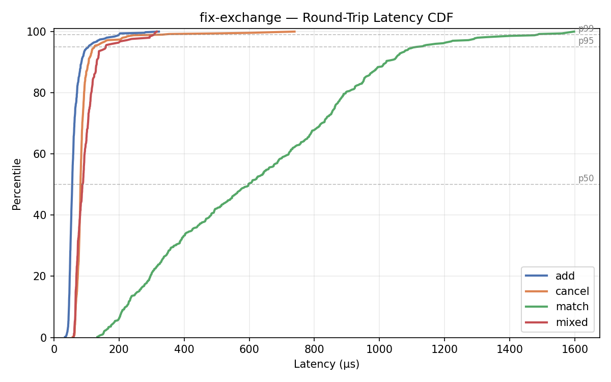
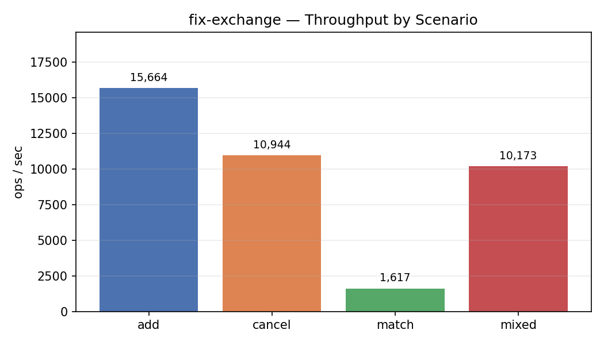

# Benchmarks

End-to-end latency and throughput measured over loopback TCP against a Release build. All timings are round-trip: from `sendall()` returning to the matching `recv()` completing on the same Python thread.

## Running

```bash
python3 -m venv .venv
.venv/bin/pip install rich matplotlib
.venv/bin/python3 tests/bench.py [options]
```

| Flag | Default | Description |
|------|---------|-------------|
| `--count N` | 500 | iterations per scenario |
| `--scenario NAME` | all | `add`, `cancel`, `match`, `mixed`, or `all` |
| `--out DIR` | `docs/bench_results` | where to write PNG charts |
| `--no-spawn` | — | connect to an already-running exchange |
| `--host` / `--port` | 127.0.0.1 / 5001 | exchange address |

Charts are saved to `docs/bench_results/latency_cdf.png` and `docs/bench_results/throughput.png`.

## Scenarios

### `add` — order add throughput
Sends N `NewOrderSingle` (resting limit buys at non-crossing prices) and measures the RTT from send to `ExecReport(New)`. Isolates the cost of the FIX parse → engine enqueue → ack path.

### `cancel` — cancel latency
Places an order, then immediately cancels it. Measures RTT from `OrderCancelRequest` send to `ExecReport(Canceled)`. One order in flight at a time; the book is nearly empty.

### `match` — match throughput
Alternates a resting sell with an aggressive buy that always crosses. Measures RTT from the aggressive-buy send to its `ExecReport(Fill)`. Exercises the matching path end-to-end.

### `mixed` — cancel under load
Pre-loads N/2 resting orders to populate the book, then cancels all of them sequentially. Cancel latency here reflects the engine under a non-trivial book size.

## Metrics

| Metric | Description |
|--------|-------------|
| p50 | median round-trip latency |
| p95 | 95th-percentile latency |
| p99 | 99th-percentile latency |
| max | worst single observation |
| ops/sec | 1 / mean latency, reported per scenario |

## Results

Run `.venv/bin/python3 tests/bench.py` to generate current numbers. Charts:




| scenario | n   | p50      | p95      | p99      | max      | ops/sec |
|----------|-----|----------|----------|----------|----------|---------|
| add      | 500 | 56.1 µs  | 105.6 µs | 199.9 µs | 322.4 µs | 15,664  |
| cancel   | 500 | 81.5 µs  | 124.1 µs | 332.7 µs | 739.2 µs | 10,944  |
| match    | 500 | 597.7 µs | 1.12 ms  | 1.49 ms  | 1.60 ms  | 1,617   |
| mixed    | 250 | 88.1 µs  | 159.2 µs | 306.4 µs | 315.9 µs | 10,173  |

*Release build, loopback TCP, WSL2.*

Match is slower than add/cancel by design: each iteration places a resting sell (1 RTT) then an aggressive buy (1 RTT with two fills in flight). The throughput figure reflects sequential single-client measurement, not concurrent load.

## Notes

- Measurements include Python socket overhead and GIL scheduling jitter — absolute numbers are not representative of a C++ client. Use relative comparisons between scenarios and builds.
- The matching engine runs on a dedicated thread; the FIX gateway submits work via a `std::queue + std::mutex`. At high message rates the queue mutex is the primary bottleneck.
- Run with a Release build (`cmake -B build -DCMAKE_BUILD_TYPE=Release`) for representative numbers; Debug builds add ~2–5× overhead.
- `SocketNodelay=Y` is set in `config/exchange.cfg`. Without it, the two fill messages generated per match (maker + taker) trigger Nagle's algorithm and inflate match latency from ~70 µs to ~41 ms.
