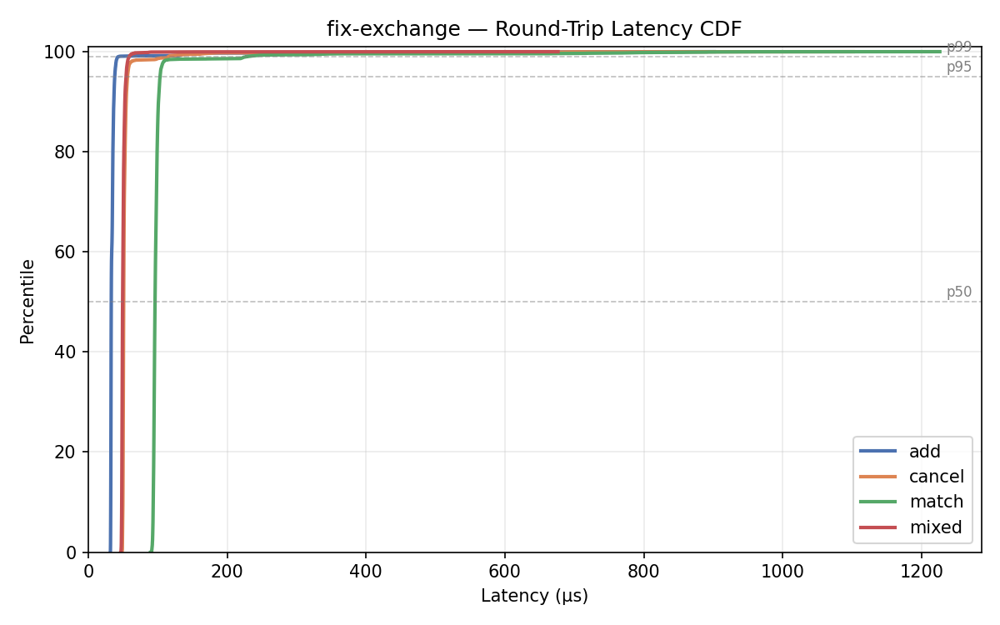
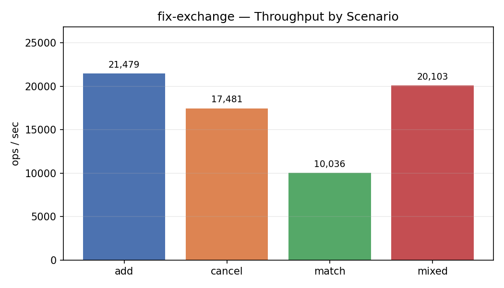
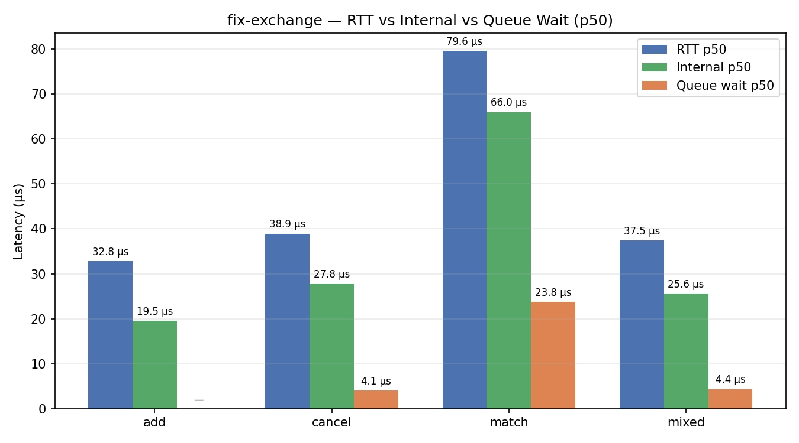
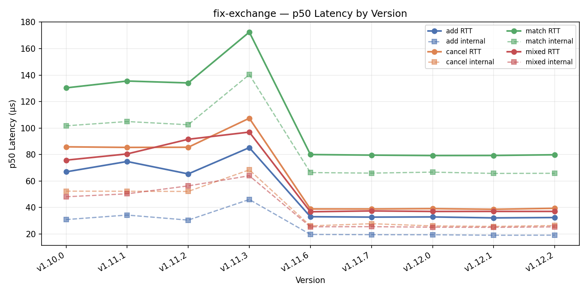
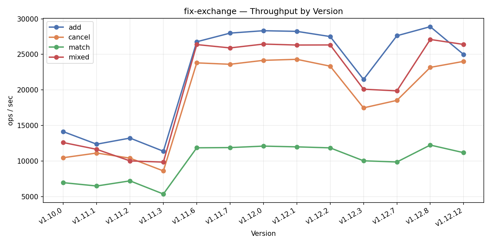

# Benchmarks

Two complementary latency measurements are taken on every benchmark run:

- **RTT** — client-perceived: from Python `sendall()` returning to `recv()` completing (before FIX parse). Includes TCP loopback and Python overhead.
- **Internal** — exchange-side: from `FixGateway::onMessage()` entry to `Session::sendToTarget()` for the response ExecReport. Pure exchange processing time.
- **Queue wait** — subset of internal: time the order spent in the SPSC ring buffer waiting for the engine thread to dequeue it.


## Running

```bash
. .venv/bin/activate
pip install rich matplotlib   # first time only

python3 bench/bench.py [options]
```

| Flag | Default | Description |
|------|---------|-------------|
| `--count N` | 10000 | recorded iterations per scenario (plus ~10% warmup) |
| `--scenario NAME` | all | `add`, `cancel`, `match`, `mixed`, or `all` |
| `--out DIR` | `bench/bench_results` | where to write PNG charts |
| `--no-spawn` | — | connect to an already-running exchange |
| `--host` / `--port` | 127.0.0.1 / 5001 | FIX acceptor address |
| `--admin-port` | 5002 | admin gateway port (for internal stats) |
| `--save` | — | persist raw samples to `bench/results.db` |
| `--version-override V` | — | version string written to DB instead of `git describe` (used by `bench/rebaseline.sh`) |

Charts are saved to `bench/bench_results/`.

## Scenarios

### `add` — order add latency
Sends N `NewOrderSingle` (resting limit buys at non-crossing prices) and measures the RTT from send to `ExecReport(New)`. Internal track: `ack_total` (arrival → New-ack send). Isolates the FIX parse → validate → ack path; the order is still submitted to the engine but the ack goes back before matching.

### `cancel` — cancel latency
Places an order, then immediately cancels it. Measures RTT from `OrderCancelRequest` send to `ExecReport(Canceled)`. One order in flight at a time; the book is nearly empty.

### `match` — match latency
Alternates a resting sell with an aggressive buy that always crosses. Measures RTT from the aggressive-buy send to its `ExecReport(Fill)`. Internal track: `fill_total` (taker arrival → Fill-ExecReport send), split into queue-wait and execution time.

### `mixed` — cancel under load
Pre-loads N/2 resting orders to populate the book, then cancels all of them sequentially. Cancel latency here reflects the engine under a non-trivial book size.

## Metrics

| Metric | Description |
|--------|-------------|
| RTT p50/p95/p99 | client-perceived round-trip latency percentiles |
| internal p50/p99 | exchange processing time (arrival → ExecReport send) |
| queue wait p50 | time order spent waiting in engine queue |
| exec time | internal − queue wait = pure book-matching time |
| ops/sec | 1 / mean RTT latency — serial single-client throughput, not peak concurrent capacity |

Internal stats are collected by the exchange process and queried via `STATS` on the admin port after each scenario. Raw nanosecond samples are returned and exact percentiles are computed by the benchmark script.

## Historical tracking (`--save`)

Pass `--save` to persist raw latency samples to `bench/results.db`. Re-running on the same version overwrites the previous results for that version. Raw samples are stored per order per scenario so any percentile can be recomputed later.

`--save` does **not** regenerate trend charts. To update the charts from the stored DB:

```bash
python3 bench/plot_history.py
```

This produces `bench/bench_results/trend_p50.png` and `bench/bench_results/trend_ops.png`.

### Automated CI

When the Release workflow completes successfully, `.github/workflows/benchmark.yml` runs automatically on a dedicated `c6i.metal` AWS spot instance (self-hosted runner labelled `aws-metal`). It builds a Release binary, runs all scenarios, commits the updated `results.db` back to `main`, then stops the instance.

**Before pushing a release**, start the instance manually — the workflow cannot start it, only stop it:

```bash
aws ec2 start-instances --instance-ids i-0e85f6c77700bb182 --region us-east-1
```

Or start it from the EC2 console. The workflow stops it automatically when done (even on failure).

**What the workflow does automatically:**
1. Checks out `main` (same commit as the release tag)
2. Creates `.venv` if not present, installs Python deps
3. Builds Release binary with `-march=native`
4. Runs `bench/bench.py --save` (10k iterations + warmup per scenario)
5. Commits `bench/results.db` to `main`
6. Stops the EC2 instance

**After the workflow completes**, pull `main` locally and regenerate charts:

```bash
git pull
python3 bench/plot_history.py
```

#### Rebaselining after a methodology change

If the benchmark methodology changes (iteration count, warmup, new scenarios), old DB entries are no longer comparable. SSH into the instance and run:

```bash
ssh -i ~/.ssh/fix-exchange-bench.pem ubuntu@<instance-ip>
cd fix-exchange && git pull
bash bench/rebaseline.sh
```

This checks out each old tag's source, builds it, and runs the current `bench.py` against it with `--version-override` so results are stored under the correct version string. Commit the updated `results.db` afterward.

To rebaseline specific tags only:

```bash
bash bench/rebaseline.sh v1.11.2 v1.11.3
```

#### AWS + GitHub setup reference

| Item | Value |
|------|-------|
| Instance ID | `i-0e85f6c77700bb182` |
| Instance type | `c6i.metal` spot, us-east-1 |
| Runner label | `aws-metal` |
| IAM user | `fix-exchange-bench` (policy: `ec2:StopInstances` on this instance only) |

GitHub Secrets required (repo Settings → Secrets → Actions):

| Secret | Description |
|--------|-------------|
| `AWS_ACCESS_KEY_ID` | IAM user access key |
| `AWS_SECRET_ACCESS_KEY` | IAM user secret key |
| `AWS_REGION` | `us-east-1` |
| `BENCHMARK_INSTANCE_ID` | `i-0e85f6c77700bb182` |

To re-register the runner (e.g. after terminating and relaunching the instance):

```bash
ssh -i ~/.ssh/fix-exchange-bench.pem ubuntu@<new-instance-ip>
cd actions-runner
./config.sh --url https://github.com/koralkulacoglu/fix-exchange --token <token-from-github> --labels aws-metal --unattended --name fix-exchange-bench
sudo ./svc.sh install && sudo ./svc.sh start
```

Get a fresh token from repo Settings → Actions → Runners → New self-hosted runner.

## Results

Run `python3 bench/bench.py` to generate current numbers.

**Latency CDF** — cumulative distribution of client-perceived RTT for each scenario. A curve shifted left means lower latency; a steeper slope means tighter distribution. The p50/p95/p99 reference lines show how the tail behaves under WSL2 scheduling jitter.



**Throughput** — sequential ops/sec derived from mean RTT (1 / mean latency), one bar per scenario. This reflects single-client sequential throughput, not peak concurrent capacity.



**Internal vs RTT** — compares three p50 numbers side-by-side for each scenario: client-perceived RTT, internal exchange processing time (arrival → ExecReport send), and queue wait (time the request sat in the engine queue waiting to be dequeued). The gap between RTT and internal is TCP loopback + Python overhead. The gap between internal and queue wait is pure book-matching execution time.



| scenario | n     | rtt p50  | rtt p99  | internal p50 | queue wait p50 | ops/sec |
|----------|-------|----------|----------|--------------|----------------|---------|
| add      | 10000 | —        | —        | —            | —              | —       |
| cancel   | 10000 | —        | —        | —            | —              | —       |
| match    | 10000 | —        | —        | —            | —              | —       |
| mixed    | 10000 | —        | —        | —            | —              | —       |

*Pending rebaseline run on bare-metal AWS. Previous WSL2 numbers are no longer comparable due to warmup and iteration count changes.*

## Historical trends

Run `python3 bench/bench.py --save` on a tagged commit to record results in `bench/results.db`. Re-running on the same tag overwrites that version's data. The DB is committed to the repo so history accumulates across releases. Run `python3 bench/plot_history.py` to regenerate the charts below.

**p50 Latency by Version** — RTT (solid) and internal processing time (dashed) per scenario per release. A downward trend means the exchange got faster; diverging RTT and internal lines indicate growing TCP/Python overhead relative to engine time.



**Throughput by Version** — sequential ops/sec per scenario per release.



## Notes

- RTT measurements include Python socket overhead and GIL scheduling jitter — absolute RTT numbers are not representative of a C++ client. Use relative comparisons between scenarios and builds.
- Internal latency is measured via `std::chrono::steady_clock` inside the exchange process and exposed through the admin gateway `STATS` command. It excludes TCP and Python overhead entirely.
- Queue wait (= `dequeue_ns − arrival_ns`) isolates mutex/condition-variable contention from actual book-traversal time. Under sequential single-client load, queue wait is near zero; it grows under concurrent multi-client load.
- Run with a Release build (`cmake -B build -DCMAKE_BUILD_TYPE=Release`) for representative numbers; Debug builds add ~2–5× overhead.
- `SocketNodelay=Y` is set in `config/exchange.cfg`. Without it, the two fill ExecReports generated per match trigger Nagle's algorithm and inflate match RTT from ~70 µs to ~41 ms.
- The matching engine runs on a dedicated thread; the FIX gateway submits work via `RingBuffer<WorkItem, 4096>` (SPSC lock-free). At high message rates, elevated queue wait times reflect ring buffer back-pressure rather than mutex contention.
